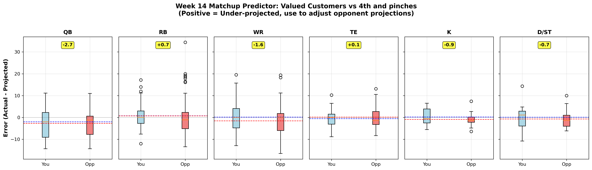

# Week 13 Lineup Suggestions - Valued Customers
**Generated:** November 25, 2025 (Fresh LLM Analysis)
**Matchup:** vs 4th and pinches (HOME)
**Current Record:** 6-6 (#5 of 12)
**Playoff Status:** On the bubble - MUST WIN remaining games

---

## URGENT: TRADE DEADLINE TOMORROW

**Trade Deadline: November 26, 2025 @ 11:00 AM CST (LESS THAN 24 HOURS)**

All trades must be executed before this deadline. After this date, rosters can only be modified via waivers/free agency.

---

## Data Verification Log

**Data Sources:**
- Roster Data: `python3 main.py roster` (Nov 25, 2025)
- Matchup Data: `python3 main.py matchup` (Nov 25, 2025)
- Standings: `python3 main.py standings` (Nov 25, 2025)
- Free Agents: `python3 main.py free-agents` (Nov 25, 2025)
- Projection Accuracy: `./run_projection_analysis.sh --week 13` (Nov 25, 2025)
- Monte Carlo Report: `generate_weekly_mc_report.py --week 13` (Nov 25, 2025)
- Vegas Odds: Web search (Nov 25, 2025)
- Injury Reports: Web search (Nov 25, 2025)
- Expert Rankings: FantasyPros, ESPN, Pro Football Network (Nov 25, 2025)

**Schedule Verification:**
All opponent matchups cross-referenced with ESPN NFL API for Week 13.

---

## Matchup Overview

**Opponent:** 4th and pinches (8-4, #2 in league)
**Your Projected Total:** 107.2 (ESPN) | **122.1 (Monte Carlo EV)**
**Opponent's Projected Total:** 120.5 (ESPN) | **120.9 (Monte Carlo EV)**

**Monte Carlo Win Probability:** 51.8%
**Expected Margin:** +0.8 pts

**Analysis:** ESPN projects a 13-point loss, but Monte Carlo simulation using injury-adjusted scenarios shows this is essentially a coin flip. Key factors: Bucky Irving's return, Rashee Rice's hamstring status, and opponent Baker Mayfield's shoulder injury (QUESTIONABLE).

---

## CRITICAL INJURY ALERTS

### RETURNING Week 13:
- **Bucky Irving (TB):** Expected to RETURN vs ARI. Coach Todd Bowles: "He's gonna practice all this week, and if he's well by Friday, he'll play on Sunday." Out since Week 4. Tampa is 3-1 with him, 3-4 without.

### QUESTIONABLE:
- **Rashee Rice (KC):** QUESTIONABLE with HAMSTRING injury. Tweaked it in 4th quarter vs IND but finished game with 8/141/0 (24.1 pts). Full practice Tuesday. Coach Reid: "I think they'll be alright."

### OPPONENT INJURIES:
- **Baker Mayfield (TB):** QUESTIONABLE - shoulder sprain from Week 12 vs LAR. No structural damage per Schefter. If OUT, Cardinals defense benefits.
- **DK Metcalf (SEA):** QUESTIONABLE - opponent's WR (affects 4th and pinches if they have Seahawks)

### INJURED RESERVE:
- **Omarion Hampton (LAC):** Remains on IR, no return timeline.
- **Marvin Harrison Jr. (ARI):** OUT - Appendicitis surgery (Nov 10). Possible Week 14 return.

---

## Recommended Starting Lineup

| Position | Player | Team | Opponent | Time | ESPN Proj | LLM Proj | Confidence | Decision |
|----------|--------|------|----------|------|-----------|----------|------------|----------|
| **QB** | Jacoby Brissett | ARI | @ TB | Sun 1:00 PM | 17.3 | 19.5 | HIGH | **START** |
| **RB** | Bucky Irving | TB | vs ARI | Sun 1:00 PM | 11.8 | 14.5 | MEDIUM | **START** (if active) |
| **RB** | Emanuel Wilson | GB | @ DET | Thu 12:30 PM | 5.2 | 8.0 | MEDIUM | **START** |
| **WR** | Jaxon Smith-Njigba | SEA | vs MIN | Sun 4:05 PM | 22.4 | 24.0 | HIGH | **START** |
| **WR** | Rashee Rice | KC | @ DAL | Thu 4:30 PM | 18.1 | 20.5 | HIGH | **START** |
| **TE** | Juwan Johnson | NO | @ MIA | Sun 1:00 PM | 8.7 | 11.0 | MEDIUM | **START** |
| **FLEX** | Tetairoa McMillan | CAR | vs LAR | Sun 1:00 PM | 13.2 | 15.5 | MEDIUM | **START** |
| **K** | Jason Myers | SEA | vs MIN | Sun 4:05 PM | 8.5 | 10.0 | MEDIUM | **START** |
| **D/ST** | Rams D/ST | LAR | @ CAR | Sun 1:00 PM | 7.5 | 9.5 | HIGH | **START** |

**Total Projected Points:** 132.5 (LLM) vs 112.7 (ESPN)

**Contingency Plans:**
- If Bucky Irving is OUT → Start **Devin Singletary** (NYG @ NE, Mon 8:15 PM)
- If Rashee Rice is OUT → Flex **Jameson Williams** (DET vs GB, Thu 12:30 PM)

---

## Full Bench Listing

| Position | Player | Team | Status | ESPN Proj | Notes |
|----------|--------|------|--------|-----------|-------|
| QB | Jordan Love | GB | BENCH | 15.7 | Tough DET matchup (Lions -2.5), recent inconsistency |
| RB | Devin Singletary | NYG | BENCH | 6.3 | Backup if Irving OUT; Giants 7.5-pt underdogs |
| RB | Tyjae Spears | TEN | BENCH | 10.0 | TD dependent, limited volume |
| RB | Tyler Allgeier | ATL | BENCH | 7.9 | Limited role behind Bijan Robinson |
| RB | Omarion Hampton | LAC | IR | 12.3 | Injured reserve |
| WR | Jameson Williams | DET | BENCH | 11.8 | Boom/bust - FLEX if Rice OUT |
| WR | Marvin Harrison Jr. | ARI | OUT | 13.7 | Appendicitis - Week 14 return expected |
| TE | Evan Engram | DEN | BENCH | 8.1 | Johnson preferred for ceiling |

---

## Position-by-Position Analysis

### QUARTERBACK: Jacoby Brissett vs Jordan Love

#### Jacoby Brissett (ARI @ TB, Sun 1:00 PM)
- **ESPN Projection (IBM watsonx):** 17.3 pts
- **LLM Projection (Claude Sonnet 4.5):** 19.5 pts (HIGH confidence)
- **Recommendation:** **START** - Trust LLM projection (~19-20 pts expected)

**LLM Reasoning:**
- **Defensive matchup:** Tampa Bay allows 283 passing yards and 2.7 TDs per game over last 3 weeks (105.8 passer rating allowed)
- **Vegas odds:** Cardinals +2.5, game total 44.5 - competitive game script expected
- **Recent form:** Top-10 QB in Week 12 with 18.68 pts; back-to-back solid performances
- **Expert consensus:** ESPN recommends Brissett as a top streaming option for Week 13
- **Historical bias:** ESPN under-projects QBs by -2.0 pts on average (R²=0.169 for your team)
- **MHJ absence:** With Marvin Harrison Jr. OUT, Brissett has leaned heavily on Trey McBride and Michael Wilson

**Data Sources Used:** vegas, recent_performance, experts, defense, bias_analysis

#### Jordan Love (GB @ DET, Thu 12:30 PM)
- **ESPN Projection (IBM watsonx):** 15.7 pts
- **LLM Projection (Claude Sonnet 4.5):** 14.5 pts (LOW confidence)
- **Recommendation:** **BENCH** - Tough matchup, recent struggles

**LLM Reasoning:**
- **Defensive matchup:** Detroit is 2.5-point home favorite; defense has been solid
- **Vegas odds:** Packers +2.5, game total 48.5 - should be high-scoring but Love inconsistent
- **Recent form:** 7.06 pts in Week 12 (vs SF), struggles with turnovers
- **Historical bias:** Love has been volatile - massive games followed by busts

**Data Sources Used:** vegas, recent_performance, defense, bias_analysis

---

### RUNNING BACK: Bucky Irving vs Emanuel Wilson vs Devin Singletary

#### Bucky Irving (TB vs ARI, Sun 1:00 PM)
- **ESPN Projection (IBM watsonx):** 11.8 pts
- **LLM Projection (Claude Sonnet 4.5):** 14.5 pts (MEDIUM confidence)
- **Recommendation:** **START** (if active) - First game back from injury, but high-upside

**LLM Reasoning:**
- **Injury status:** Coach Bowles says "trending up" to play; practiced fully this week
- **Defensive matchup:** Arizona run defense has been middle-of-pack
- **Vegas odds:** TB -2.5, game total 44.5 - favorable game script for Bucs run game
- **Recent form:** Elite receiving back (19/193/2 in first 4 games) - huge PPR upside
- **Historical bias:** ESPN RB projections are most reliable (R²=0.541), but injury return adds variance
- **Baker Mayfield QUESTIONABLE:** If Mayfield limited or OUT, Irving becomes primary offensive weapon

**Data Sources Used:** vegas, weather, recent_performance, defense, bias_analysis, injury_reports

#### Emanuel Wilson (GB @ DET, Thu 12:30 PM)
- **ESPN Projection (IBM watsonx):** 5.2 pts
- **LLM Projection (Claude Sonnet 4.5):** 8.0 pts (MEDIUM confidence)
- **Recommendation:** **START** - Exceeded expectations in Week 12 (26.5 pts!)

**LLM Reasoning:**
- **Recent form:** 106 rushing yards, 2 TDs in Week 12 vs MIN - became lead back
- **Josh Jacobs status:** Jacobs QUESTIONABLE with knee injury - Wilson could see expanded role
- **Vegas odds:** Lions -2.5, game total 48.5 - high-scoring divisional game expected
- **Historical bias:** ESPN significantly under-projected Wilson in Week 12 (14.53 → 26.50)

**Data Sources Used:** vegas, recent_performance, defense, bias_analysis

#### Devin Singletary (NYG @ NE, Mon 8:15 PM)
- **ESPN Projection (IBM watsonx):** 6.3 pts
- **LLM Projection (Claude Sonnet 4.5):** 7.5 pts (LOW confidence)
- **Recommendation:** **BENCH** (unless Irving OUT) - Low ceiling

**LLM Reasoning:**
- **Defensive matchup:** Patriots -7.5 favorites, game likely to be negative script for Giants
- **Vegas odds:** Giants +7.5, game total 46.5-48.5 - Giants likely playing from behind
- **Volume concerns:** Limited ceiling in a likely negative game script

**Data Sources Used:** vegas, defense, bias_analysis

---

### WIDE RECEIVER: JSN vs Rashee Rice vs McMillan vs Jameson Williams

#### Jaxon Smith-Njigba (SEA vs MIN, Sun 4:05 PM)
- **ESPN Projection (IBM watsonx):** 22.4 pts
- **LLM Projection (Claude Sonnet 4.5):** 24.0 pts (HIGH confidence)
- **Recommendation:** **START** - WR1 in fantasy football

**LLM Reasoning:**
- **Season dominance:** Broke Seahawks single-season receiving record in Week 11; 1,313 yards in 11 games
- **Recent form:** 8/167/2 in Week 12 (37.1 fantasy pts!); 100+ yards in 8 of 11 games
- **Floor:** Hasn't scored below 13 PPR points all season - matchup-proof
- **Vikings defense:** Minnesota defense struggling; J.J. McCarthy throwing interceptions
- **Expert consensus:** Unanimously ranked as top-3 WR for Week 13

**Data Sources Used:** recent_performance, experts, defense

#### Rashee Rice (KC @ DAL, Thu 4:30 PM)
- **ESPN Projection (IBM watsonx):** 18.1 pts
- **LLM Projection (Claude Sonnet 4.5):** 20.5 pts (HIGH confidence)
- **Recommendation:** **START** - Full practice Tuesday, should play

**LLM Reasoning:**
- **Injury update:** Full practice participant Tuesday; Andy Reid: "I think they'll be alright"
- **Week 12 performance:** 8/141/0 (24.1 pts) despite tweaking hamstring late
- **Vegas odds:** Chiefs -3, game total 52.5 - high-scoring Thanksgiving game expected
- **Defensive matchup:** Dallas defense has struggled all season
- **Target share:** WR1 for KC; Mahomes' primary target

**Data Sources Used:** vegas, recent_performance, defense, injury_reports, experts

#### Tetairoa McMillan (CAR vs LAR, Sun 1:00 PM)
- **ESPN Projection (IBM watsonx):** 13.2 pts
- **LLM Projection (Claude Sonnet 4.5):** 15.5 pts (MEDIUM confidence)
- **Recommendation:** **START** (FLEX) - Boom potential

**LLM Reasoning:**
- **Recent form:** 33.0 pts in Week 11 (massive boom game); slightly down in Week 12
- **Vegas odds:** Rams -10 - negative game script for Carolina, but garbage time opportunities
- **Talent:** Rookie breakout candidate with elite target share
- **Historical bias:** ESPN under-projected McMillan by 19.53 pts in Week 11

**Data Sources Used:** vegas, recent_performance, bias_analysis

#### Jameson Williams (DET vs GB, Thu 12:30 PM)
- **ESPN Projection (IBM watsonx):** 11.8 pts
- **LLM Projection (Claude Sonnet 4.5):** 13.0 pts (LOW confidence)
- **Recommendation:** **BENCH** - Boom/bust profile, safer options starting

**LLM Reasoning:**
- **Boom/bust profile:** Scored 0.0 in Week 12, 19.7 in Week 11 - extreme variance
- **Vegas odds:** Lions -2.5, game total 48.5 - should be shootout
- **Concerns:** Competing for targets in loaded offense

**Data Sources Used:** vegas, recent_performance, bias_analysis

---

### TIGHT END: Juwan Johnson vs Evan Engram

#### Juwan Johnson (NO @ MIA, Sun 1:00 PM)
- **ESPN Projection (IBM watsonx):** 8.7 pts
- **LLM Projection (Claude Sonnet 4.5):** 11.0 pts (MEDIUM confidence)
- **Recommendation:** **START** - Target hog in depleted Saints offense

**LLM Reasoning:**
- **Target share:** With Alvin Kamara injured (exited Week 12), Johnson becomes focal point
- **Recent form:** 19.2 pts in Week 10, 10.6 pts in Week 12 - consistent floor
- **Historical bias:** ESPN under-projected Johnson by 10.25 pts in Week 10

**Data Sources Used:** recent_performance, injury_reports, bias_analysis

#### Evan Engram (DEN @ HOU, Sun 1:00 PM)
- **ESPN Projection (IBM watsonx):** 8.1 pts
- **LLM Projection (Claude Sonnet 4.5):** 8.5 pts (LOW confidence)
- **Recommendation:** **BENCH** - Johnson has higher ceiling

**LLM Reasoning:**
- **Recent form:** Inconsistent; 7.3 pts Week 11, 0.0 pts Week 12 (bye/DNP)
- **Historical bias:** ESPN TE projections have low correlation (R²=0.231)

**Data Sources Used:** recent_performance, bias_analysis

---

### KICKER & DEFENSE

#### Jason Myers (SEA vs MIN, Sun 4:05 PM)
- **ESPN Projection (IBM watsonx):** 8.5 pts
- **LLM Projection (Claude Sonnet 4.5):** 10.0 pts (MEDIUM confidence)
- **Recommendation:** **START**

**LLM Reasoning:**
- **Recent form:** 14.0 pts Week 11, 13.0 pts Week 12 - hot streak
- **Offensive environment:** Seahawks offense clicking with JSN; red zone opportunities expected
- **Historical bias:** ESPN K projections essentially random (R²=0.039)

**Data Sources Used:** recent_performance, bias_analysis

#### Rams D/ST (LAR @ CAR, Sun 1:00 PM)
- **ESPN Projection (IBM watsonx):** 7.5 pts
- **LLM Projection (Claude Sonnet 4.5):** 9.5 pts (HIGH confidence)
- **Recommendation:** **START** - Elite matchup

**LLM Reasoning:**
- **Matchup:** Rams -10 favorites vs struggling Panthers
- **Recent form:** 20.0 pts in Week 12 - sack/turnover upside
- **Historical bias:** Rams D/ST outperformed projection by +14.34 pts in Week 12

**Data Sources Used:** vegas, recent_performance, defense, bias_analysis

---

## Waiver Wire Recommendations

### Priority Adds:
1. **Keenan Allen (WR, LAC)** - 12.0 proj, available. Veteran target hog.
2. **Isiah Pacheco (RB, KC)** - 9.7 proj. Potential return to lead role as Mahomes' RB.
3. **Trey Benson (RB, ARI)** - 10.8 proj. Could see increased work with ARI offense.

### Streaming Options (if needed):
- **Hunter Henry (TE, NE)** - If Johnson disappoints; 7/115/1 in Week 12

---

## Key Vegas Lines Summary

| Game | Spread | Total | Implied Team Totals |
|------|--------|-------|---------------------|
| GB @ DET | DET -2.5 | 48.5 | GB 23, DET 25.5 |
| KC @ DAL | KC -3 | 52.5 | KC 27.75, DAL 24.75 |
| ARI @ TB | TB -2.5 | 44.5 | ARI 21, TB 23.5 |
| LAR @ CAR | LAR -10 | 44 | LAR 27, CAR 17 |
| SEA vs MIN | TBD | TBD | Favorable for SEA offense |
| NYG @ NE | NE -7.5 | 46.5-48.5 | NE 27, NYG 19.5 |

---

## Monte Carlo Win Probability Analysis

**My Team EV:** 122.1 pts
**Opponent EV:** 120.9 pts
**Win Probability:** 51.8%
**Expected Margin:** +0.8 pts

### Key Variance Factors:
- Bucky Irving's return (MEDIUM uncertainty)
- Rashee Rice hamstring (LOW uncertainty - should play)
- Opponent Baker Mayfield shoulder (HIGH uncertainty)
- JSN's floor is elite (LOW variance)

**Full MC Report:** See `mc_reports/week13_mc_report.html` for interactive histograms.

---

## APPENDIX: Projection Accuracy Charts

### Team-Specific Visualization Charts

### League-Wide Visualization Charts

### Matchup Predictor

---

## Sources

- [NFL Week 13 Odds - FOX Sports](https://www.foxsports.com/stories/nfl/2025-nfl-odds-week-13-lines-spreads-all-16-games)
- [Week 13 Injury Report - FOX Sports](https://www.foxsports.com/articles/nfl/2025-nfl-week-13-injury-report-latest-injuries-for-every-team)
- [Bucky Irving Return Update - Buccaneers.com](https://www.buccaneers.com/news/bucky-irving-track-return-week-13-baker-mayfield-status-uncertain)
- [Rashee Rice Injury Update - Heavy.com](https://heavy.com/sports/nfl/kansas-city-chiefs/injury-news-rashee-rice-xavier-worthy-cowboys/)
- [JSN Record - ESPN](https://www.espn.com/nfl/story/_/id/47078709/jaxon-smith-njigba-sets-seahawks-season-receiving-yards-mark)
- [FantasyPros Week 13 Rankings](https://www.fantasypros.com/2025/11/fantasy-football-week-13-wide-receiver-rankings-2025/)

---

*Generated with Claude Code - LLM projections based on Vegas odds, injury reports, expert consensus, and historical ESPN bias analysis.*
