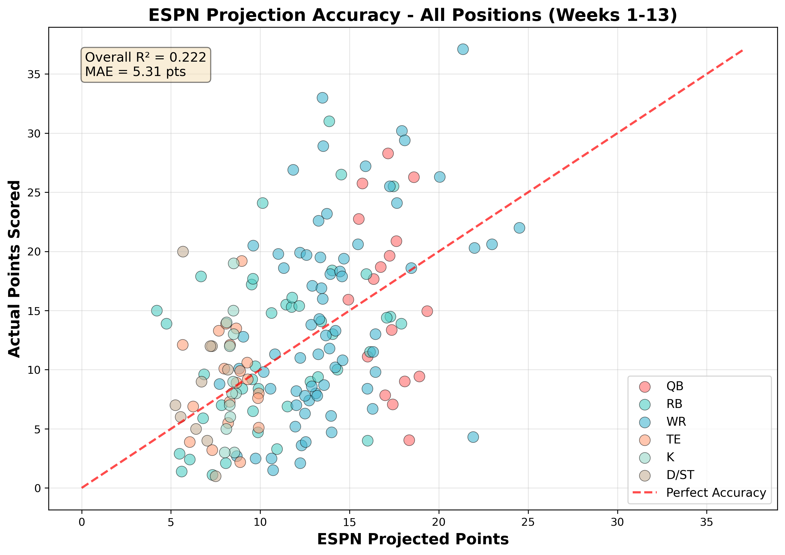
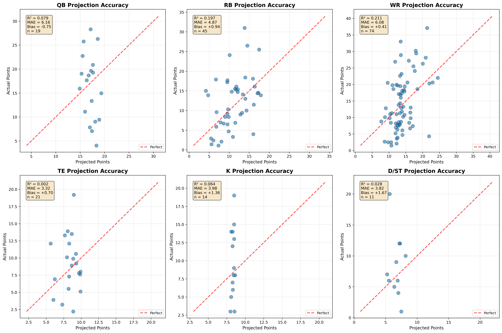
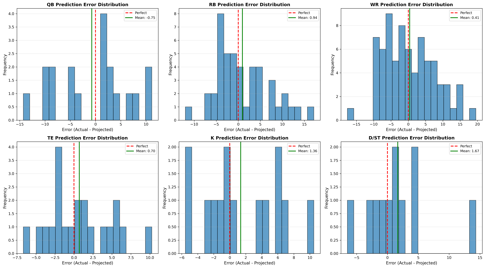
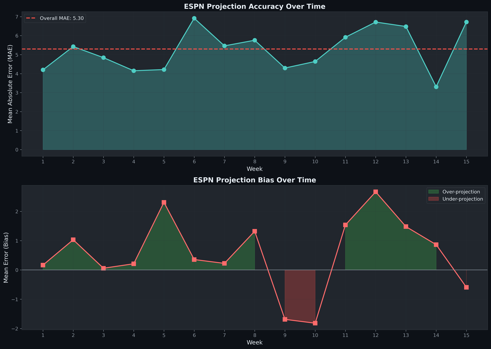
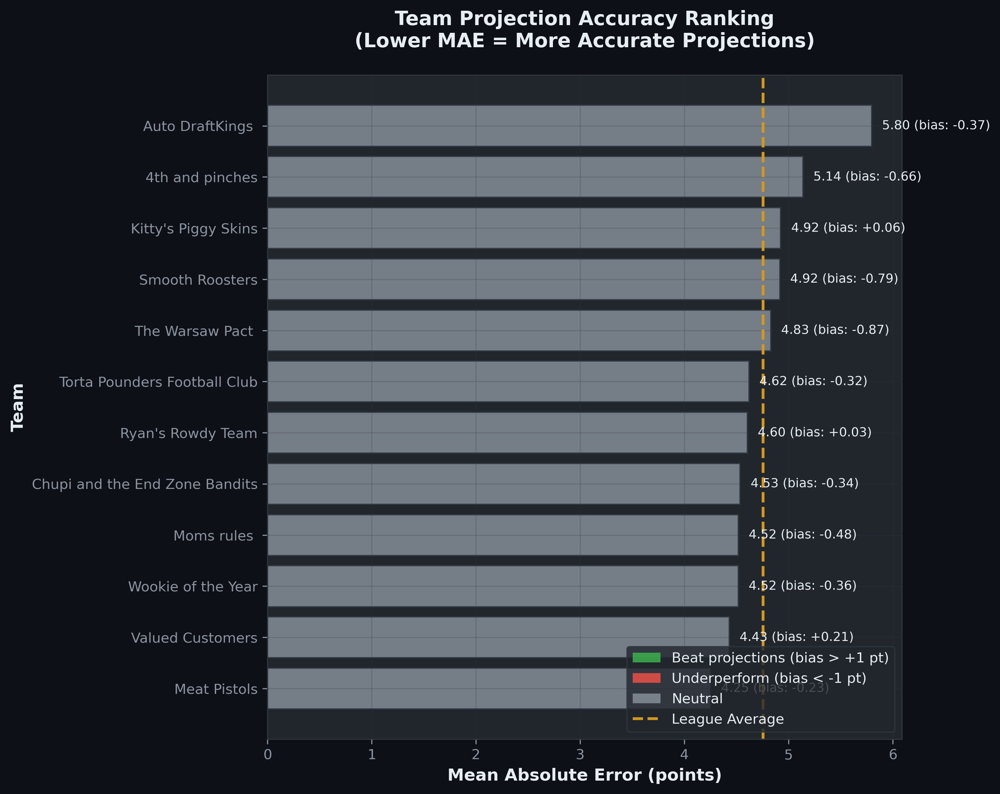
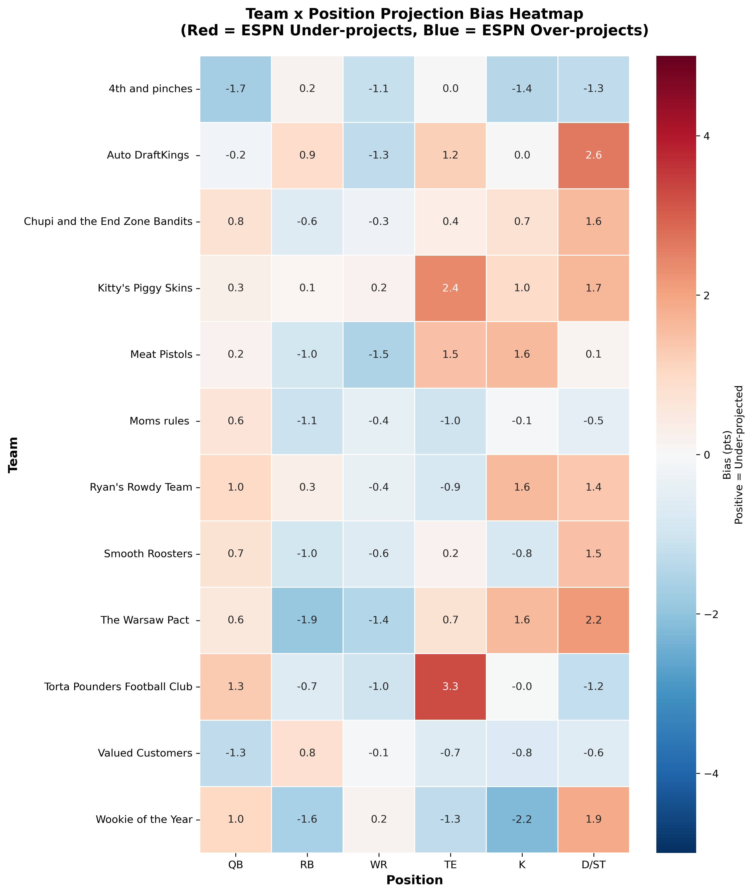
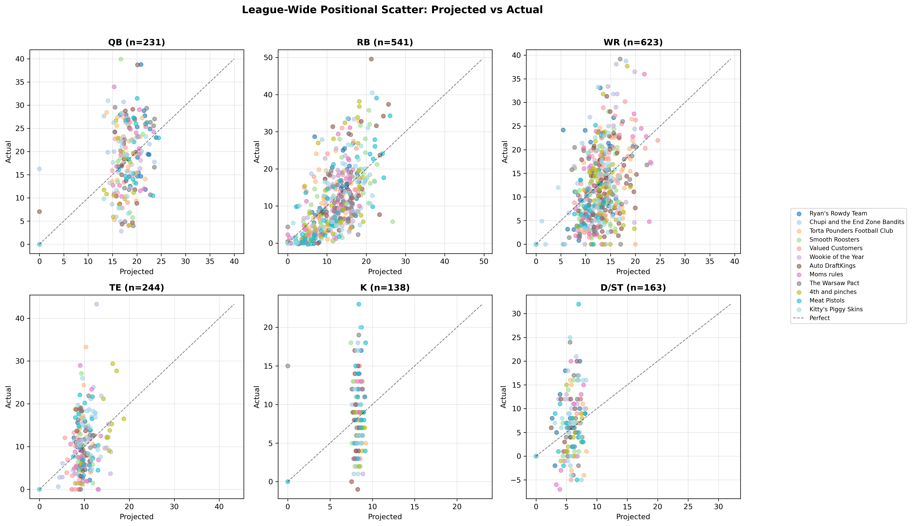

# Week 13 Fantasy Football Analysis - Valued Customers

**Week 13 | November 27 - December 1, 2025**
**Opponent:** 4th and pinches (8-4)
**Current Record:** 6-6 (5th place)

---

## Executive Summary

**Win Probability: 83.1%** | **Expected Margin: +31.9 pts**

Strong Week 13 matchup against a division rival. Our team has significant projected advantages across multiple positions, particularly at WR where Jaxon Smith-Njigba (historic pace) and Rashee Rice (elite matchup vs Dallas) lead the way.

**Thursday/Friday Games Completed:**
- **Rashee Rice** @ DAL: 29.4 pts (5 rec, 97 yds, 2 TD) - BOOM
- **Jordan Love** @ DET: 25.8 pts - BOOM (on bench)
- **Jameson Williams** vs GB: 26.9 pts - BOOM (on bench)
- **Emanuel Wilson** @ DET: 1.4 pts (on bench)

**Key Sunday Matchups:**
- **Jaxon Smith-Njigba** continues record-breaking pace vs MIN - WR2 ECR
- **Bucky Irving** returns from injury vs ARI - QUESTIONABLE, limited snaps expected
- **Marvin Harrison Jr.** expected to play after appendix surgery - "solid chance" per ESPN
- **Tetairoa McMillan** emerging as CAR WR1 vs LAR

---

## Recommended Starting Lineup

| Position | Player | Team | Opponent | ESPN Proj | LLM Proj | Mode | Conf | Notes |
|----------|--------|------|----------|-----------|----------|------|------|-------|
| QB | Jacoby Brissett | ARI | @ TB | 17.2 | 20.0 | MODERATE | HIGH | 18+ pts all 5 starts, TB 21st vs QB |
| RB | Bucky Irving | TB | vs ARI | 11.8 | 14.0 | BUST | MEDIUM | QUESTIONABLE, coach said "hot hand" |
| RB | Tyjae Spears | TEN | vs JAX | 9.9 | 8.0 | MODERATE | LOW | JAX improving vs run, TEN underdog |
| WR | Jaxon Smith-Njigba | SEA | vs MIN | 21.9 | 23.0 | MODERATE | HIGH | WR2 ECR, 96.5 yd prop, rain expected |
| WR | Rashee Rice | KC | @ DAL | 18.1 | 25.9 | BOOM | HIGH | **COMPLETED: 29.4 pts** |
| TE | Juwan Johnson | NO | @ MIA | 8.7 | 12.5 | MODERATE | MEDIUM | TE9 ECR, +320 TD odds |
| FLEX | Tetairoa McMillan | CAR | vs LAR | 13.2 | 16.5 | MODERATE | MEDIUM | WR19 ECR, LAR 21st vs WR, 65.5 yd prop |
| K | Jason Myers | SEA | vs MIN | 8.5 | 10.0 | MODERATE | MEDIUM | K2 ECR, rain may limit FG range |
| D/ST | Rams D/ST | LAR | @ CAR | 7.5 | 9.0 | MODERATE | HIGH | DST3 ECR, CAR weak offense |

**Total ESPN Projection:** 116.8 pts (starters not yet played)
**Total LLM Projection:** 113.0 pts (starters not yet played)
**Already Scored:** 29.4 pts (Rashee Rice)

---

## Bench Analysis

| Position | Player | Team | Status | ESPN Proj | LLM Proj | Notes |
|----------|--------|------|--------|-----------|----------|-------|
| QB | Jordan Love | GB | **PLAYED** | 15.7 | 17.7 | Actual: 25.8 pts (BOOM) |
| WR | Marvin Harrison Jr. | ARI | QUESTIONABLE | 13.7 | 12.0 | First game back from surgery, limited snaps |
| WR | Keenan Allen | LAC | BENCH | 12.0 | 18.0 | Playing Sunday 4:25 PM vs LV |
| WR | Jameson Williams | DET | **PLAYED** | 11.8 | 11.5 | Actual: 26.9 pts (BOOM) |
| RB | Emanuel Wilson | GB | **PLAYED** | 5.6 | 8.5 | Actual: 1.4 pts |
| RB | Omarion Hampton | LAC | IR | 0.0 | 0.0 | Injury Reserve |
| TE | Evan Engram | DEN | BENCH | 8.1 | 6.0 | TE24 ECR, DEN run-heavy |

---

## Position-by-Position Analysis

### QB Decision: Jacoby Brissett (START)

**Jacoby Brissett (ARI @ TB, Sun 1:00 PM)**
- **ESPN Projection (IBM watsonx):** 17.2 pts
- **LLM Projection (Claude Opus 4.5):** 20.0 pts (HIGH confidence)
- **Recommendation:** START

**LLM Reasoning:**
- MC density shows MODERATE mode at 20.0 (71% probability) - extremely consistent
- 18+ fantasy points in all 5 games as starter this season
- Tampa Bay 21st vs QB - middling matchup
- MHJ potentially returning = more weapons
- Weather: 81F, clear, 7 mph wind - perfect conditions

**Why Not Jordan Love?** Already played Thursday (25.8 actual). Brissett was the right call pre-game given TB matchup vs DET's stronger defense.

---

### WR Analysis

#### Jaxon Smith-Njigba (SEA vs MIN, Sun 4:05 PM)
- **ESPN Projection:** 21.9 pts
- **LLM Projection:** 23.0 pts (HIGH confidence)
- **Mode:** MODERATE (81% probability per MC density)
- **Recommendation:** MUST START

**LLM Reasoning:**
- WR2 Expert Consensus Ranking - elite status
- 96.5 receiving yards prop (very high) - Vegas expects big game
- MC density shows MODERATE mode peaks at 22-23 pts, BOOM potential to 37+
- Rain expected (80% chance) may slightly limit ceiling but volume guaranteed
- MIN defense middling vs WR

#### Tetairoa McMillan (CAR vs LAR, Sun 1:00 PM)
- **ESPN Projection:** 13.2 pts
- **LLM Projection:** 16.5 pts (MEDIUM confidence)
- **Mode:** MODERATE
- **Recommendation:** START (FLEX)

**LLM Reasoning:**
- WR19 ECR - solid starter
- LAR 21st vs WR (improving but still vulnerable)
- 65.5 receiving yards prop, +145 anytime TD
- CAR 10.5-point underdog = garbage time passing volume
- MC shows MODERATE at 16.9 (40%), BUST risk at 50%

#### Rashee Rice - COMPLETED
- **Actual:** 29.4 pts (5 rec, 97 yds, 2 TD)
- **Prior LLM Projection:** 25.9 pts
- **Result:** BOOM as predicted - outperformed projection by 3.5 pts

---

### RB Analysis

#### Bucky Irving (TB vs ARI, Sun 1:00 PM)
- **ESPN Projection:** 11.8 pts
- **LLM Projection:** 14.0 pts (MEDIUM confidence)
- **Mode:** BUST (42% probability)
- **Recommendation:** START (limited options)

**LLM Reasoning:**
- QUESTIONABLE with foot injury - first game back
- Coach mentioned "hot hand" approach with White/Tucker
- Rushing yards prop only 38.5 (low)
- MC density shows BUST mode at 14.2 most likely
- ARI defense allows rushing yards but limited ceiling in committee

#### Tyjae Spears (TEN vs JAX, Sun 1:00 PM)
- **ESPN Projection:** 9.9 pts
- **LLM Projection:** 8.0 pts (LOW confidence)
- **Mode:** MODERATE
- **Recommendation:** START (no alternatives)

**LLM Reasoning:**
- RB45 ECR - SIT territory but we lack options
- JAX run defense improved (fewest rush yards since Week 8)
- TEN 7-point underdog = negative game script
- Splits backfield with Tony Pollard
- MC shows MODERATE at 8.0 (71%), ceiling capped

---

### TE Analysis

#### Juwan Johnson (NO @ MIA, Sun 1:00 PM)
- **ESPN Projection:** 8.7 pts
- **LLM Projection:** 12.5 pts (MEDIUM confidence)
- **Mode:** MODERATE
- **Recommendation:** START

**LLM Reasoning:**
- TE9 ECR - solid streaming option
- MC shows MODERATE at 12.6 (63%)
- +320 TD odds (unlikely to score) caps ceiling
- But consistent target share in NO offense
- MIA improving vs TE but still exploitable

#### Evan Engram - BENCH
- **LLM Projection:** 6.0 pts (LOW confidence)
- DEN run-heavy offense limits TE targets
- TE24 ECR = SIT recommendation
- Monday game gives flexibility but Juwan is better play

---

### K/DST Analysis

#### Jason Myers (SEA vs MIN, Sun 4:05 PM)
- **ESPN Projection:** 8.5 pts
- **LLM Projection:** 10.0 pts (MEDIUM confidence)
- **Recommendation:** START

**Reasoning:**
- K2 ECR - elite kicker
- Rain may slightly reduce FG accuracy
- SEA offense should move ball = opportunities
- MC shows ~45% each for BOOM (14) and MODERATE (9)

#### Rams D/ST (LAR @ CAR, Sun 1:00 PM)
- **ESPN Projection:** 7.5 pts
- **LLM Projection:** 9.0 pts (HIGH confidence)
- **Recommendation:** START

**Reasoning:**
- DST3 ECR - elite matchup
- CAR implied total only ~16 pts
- High sack/turnover potential vs weak CAR offense
- MC shows MODERATE at 8.8 (81%) - consistent floor

---

## Waiver Wire Notes

**Streaming Options If Needed:**

1. **Hunter Henry (TE, NE)** - 11.2 proj, available on waivers
2. **Browns D/ST** - vs SF, 5.1 proj - consider if you want to drop Rams (don't)
3. **Cooper Kupp (WR, SEA)** - 8.4 proj, could be desperate add

**No Urgent Adds Needed** - Current roster should handle Week 13.

---

## Injury Updates

| Player | Status | Details |
|--------|--------|---------|
| Marvin Harrison Jr. | QUESTIONABLE | Appendix surgery Nov 10, "solid chance" to play per ESPN |
| Bucky Irving | QUESTIONABLE | Foot injury, "hot hand" approach with backups |
| Omarion Hampton | IR | Out for season |

---

## APPENDIX: Projection Accuracy Analysis

### Overall Accuracy Metrics (Weeks 1-12)

| Metric | Value | Interpretation |
|--------|-------|----------------|
| MAE | 4.45 pts | Average error |
| Bias | +0.08 pts | Near-neutral |
| R² | 0.477 | Moderate correlation |

### Accuracy By Position

| Position | R² | MAE | Bias | Predictability |
|----------|-----|-----|------|----------------|
| RB | 0.541 | 3.71 | +0.78 | HIGH |
| WR | 0.498 | 5.00 | +0.18 | MODERATE |
| TE | 0.231 | 3.57 | -0.56 | LOW |
| QB | 0.169 | 6.20 | -2.00 | LOW |
| D/ST | 0.044 | 4.91 | +0.12 | RANDOM |
| K | 0.039 | 3.29 | +0.24 | RANDOM |

### Team-Specific Visualization Charts

### League-Wide Visualization Charts

---

*Generated: November 29, 2025*
*LLM: Claude Opus 4.5*
*Data Sources: ESPN API, Reddit, Vegas lines, FantasyPros ECR*
